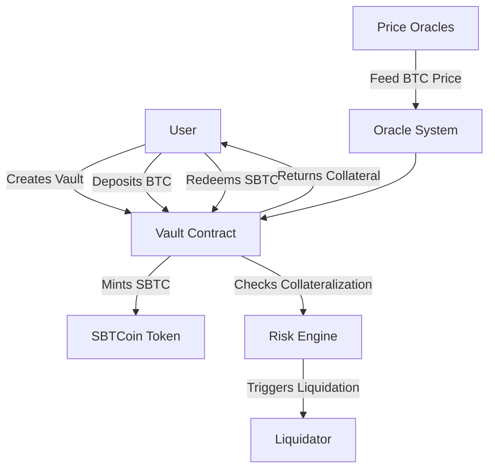

# SBTCoin - Bitcoin-Backed Stablecoin Protocol

**SBTCoin** is a decentralized stablecoin protocol built on the [Stacks blockchain](https://www.stacks.co/) that enables users to mint a stable asset backed by Bitcoin collateral. The protocol uses over-collateralized BTC vaults, liquidation mechanisms, and decentralized oracles to ensure solvency and stability.

---

## 📌 Key Features

* **Bitcoin-Backed**: Uses BTC as collateral for minting SBTC (SBTCoin USD), pegged to the US Dollar.
* **Vault-Based System**: Users create personal vaults to deposit BTC and mint SBTC.
* **Decentralized Oracles**: Price data is supplied by multiple whitelisted oracles.
* **Risk Management**: Over-collateralization, liquidation thresholds, and minting limits protect against insolvency.
* **Governance**: Protocol parameters (e.g., collateralization ratio) can be adjusted by the contract owner.

---

## 🧱 Protocol Architecture



* **Vault Contract**: Maintains user vaults with BTC collateral and minted SBTC.
* **Oracle System**: Tracks BTC price updates submitted by trusted oracles.
* **Risk Engine**: Validates safe minting and triggers liquidation when undercollateralized.
* **SBTCoin Token**: SIP-010 compatible token representing the stablecoin.

---

## ⚙️ How It Works

### 1. Create a Vault

Users call `create-vault` with a BTC collateral amount to establish a vault.

### 2. Mint SBTC

Users can mint SBTC using the `mint-stablecoin` function, constrained by:

* Collateralization Ratio (default: **150%**)
* Maximum Mint Limit (default: **1,000,000 SBTC**)

### 3. Price Oracle

Authorized oracles call `update-btc-price`, which the system uses to assess vault health.

### 4. Liquidation

If a vault falls below the **125% liquidation threshold**, any third-party can call `liquidate-vault`.

### 5. Redemption

Users can redeem their stablecoins using `redeem-stablecoin`, which burns SBTC and frees up BTC collateral.

---

## 🔐 Security & Constraints

* **Collateral Ratio**: Min 150%, enforced at mint.
* **Liquidation Threshold**: 125%, allows recovery of bad debt.
* **Oracle Access**: Restricted to pre-approved addresses.
* **Timestamp & Price Limits**: Guards against malicious or erroneous input.

---

## 📁 File Structure

```
/contracts
 └── sbtc-stablecoin.clar   # Main protocol contract (this file)
README.md           # Project overview and architecture
```

---

## 🚀 Deployment & Governance

* **Contract Owner**: Can modify key protocol parameters via governance functions (e.g., `update-collateralization-ratio`).
* **Decentralization Roadmap**: Future releases may delegate governance to DAO mechanisms.

---

## 📜 SIP-010 Compatibility

SBTC follows the [SIP-010](https://github.com/stacksgov/sips/blob/main/sips/sip-010/sip-010-token-standard.md) fungible token standard, ensuring interoperability with other Stacks DeFi apps.

---

## 🔍 Read-Only Functions

* `get-vault-details`: Returns user vault data.
* `get-latest-btc-price`: Current BTC price from the oracle.
* `get-total-supply`: Total SBTC in circulation.
* `get-protocol-info`: Protocol configuration snapshot.

---

## ❗ Error Codes

| Code                           | Description                        |
| ------------------------------ | ---------------------------------- |
| `ERR-NOT-AUTHORIZED`           | Action restricted to owner/oracle  |
| `ERR-INVALID-COLLATERAL`       | Invalid BTC deposit amount         |
| `ERR-UNDERCOLLATERALIZED`      | Insufficient BTC to mint           |
| `ERR-LIQUIDATION-FAILED`       | Vault not eligible for liquidation |
| `ERR-ORACLE-PRICE-UNAVAILABLE` | No valid BTC price found           |

---

## 🧪 Future Enhancements

* ⚖️ **DAO Integration** for permissionless parameter changes
* 🧠 **Oracle Network Expansion** for better decentralization
* 🏦 **BTC Wrapping & Custodianship Layer**
* 🛠️ **Front-end DApp** for user vault management

---

## 🧑‍💻 Development

To contribute or audit the protocol, clone and inspect the main contract:

```bash
git clone https://github.com/abolore-install/sbtc-stablecoin.git
```

For local testing, use [Clarinet](https://docs.stacks.co/write-smart-contracts/clarinet/overview/) for simulating Stacks contracts:

```bash
clarinet test
```
